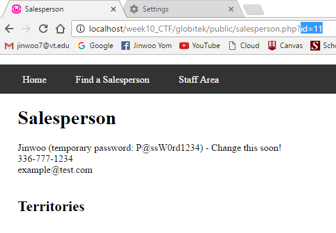
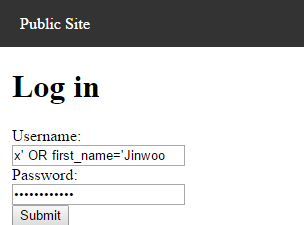
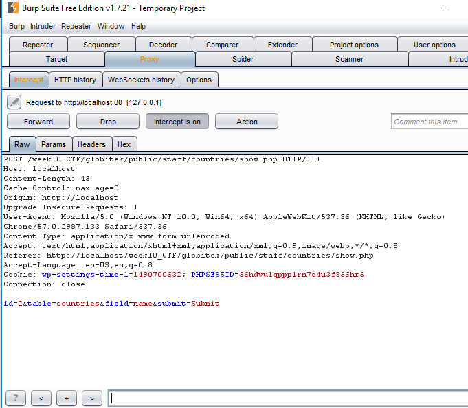

# Project 10 - Fortress Globitek_CTF

Time spent: **5** hours spent in total

> Objective: Create an intentionally vulnerable version of the Globitek application with a secret that can be stolen.

### Requirements

- [x] All source code and assets necessary for running app
- [x] `/globitek.sql` containing all required SQL, including the `secrets` table
- [x] GIF Walkthrough of compromise

- [x] Brief writeup about the vulnerabilities introduced below

<dl>
	
	<dt>Vulnerability #1: Insecure Direct Object Reference (IDOR)</dt>
	<dd>There is a IDOR vulnerability in the show.php for the public 
	\"find a salesperson\" page. You can access the salesperson that has 
	id=11, a hidden account, to obtain a first name and a password for
	one of the account holder.</dd>
</dl>
<dl>
	
	<dt>Vulnerability #2: SQL Injection (SQLi)</dt>
	<dd>We now know the first name and the password of an account, but
	we don't know the username. Luckily, username input box in the login
	page has a SQL Injection vulnerability. Thus, instead of figuring out
	the username, we can write a SQL command that directly queries it.
	In the username box, input: <em>x' OR first_name='Jinwoo</em>.</dd>
</dl>
<dl>
	
	<dt>Vulnerability #3: Post request field manipulation using Burp</dt>
	<dd>Once we are logged in, we can go to a show.php page for countries
	where it has some post fields that are vulnerable to be manipulated
	using burp. There, you can define which table you want query from, 
	which entry you want to view, and which field you want to veiw. In 
	order to view the secret code, you need to modify the fields to match 
	the following:<em>id=1&table=secrets&field=secret&submit=Submit</em></dd>
</dl>

### Vulnerabilities
- Vulnerability #1: Insecure Direct Object Reference (IDOR)
- Vulnerability #2: SQL Injection (SQLi)
- Vulnerability #3: Post request field manipulation using Burp

## License

    Copyright [2017] [Jinwoo Yom]

    Licensed under the Apache License, Version 2.0 (the "License");
    you may not use this file except in compliance with the License.
    You may obtain a copy of the License at

        http://www.apache.org/licenses/LICENSE-2.0

    Unless required by applicable law or agreed to in writing, software
    distributed under the License is distributed on an "AS IS" BASIS,
    WITHOUT WARRANTIES OR CONDITIONS OF ANY KIND, either express or implied.
    See the License for the specific language governing permissions and
    limitations under the License.
